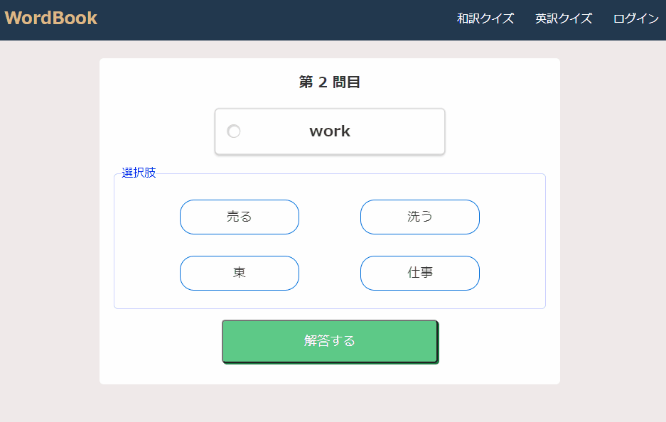

# WordBook
日本語と英語の単語帳アプリケーションです。  
和訳と英訳の問題作成、クイズができます。  
スマートフォンからも実行可能です。  

# URL
https://mikanbako.sakura.ne.jp/Wordbook/

# 使用言語
* PHP
* Javascript
* jQuery
* HTML
* CSS
* MySQL

# 開発環境
* Windows10
* XAMPP
* VSCode

# 機能一覧
* トップページ
* 問題編集画面
  * 新規登録
  * 更新
  * 削除
  * 登録データ一覧閲覧
* クイズ画面
  * 出題設定
  * クイズ解答
  * 結果表示

# 使用方法
## トップ画面
問題編集画面、クイズ画面へ遷移できます。

①：問題編集画面に進みます。  
②：選択した種類のクイズ画面に進みます。  
③：選択した各画面へ進みます。  

## 問題編集画面

## クイズ画面

# リンク
* [Github](https://github.com/yoshitaka7144)
* [ポートフォリオ](https://mikanbako.sakura.ne.jp/portfolio/)